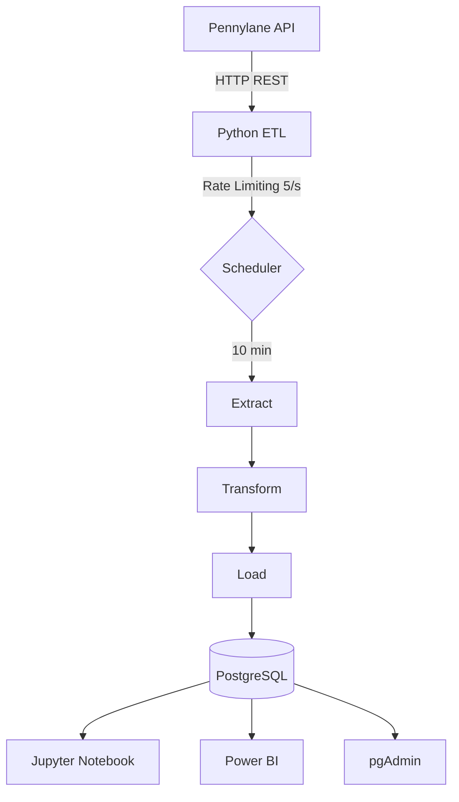
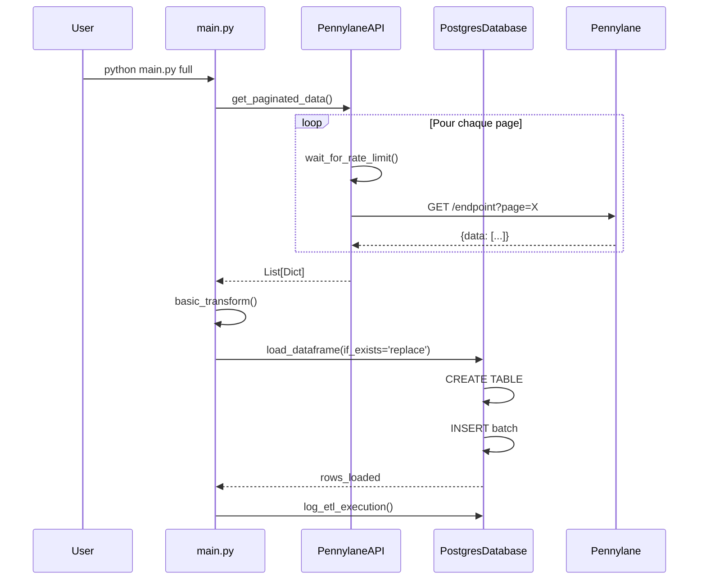
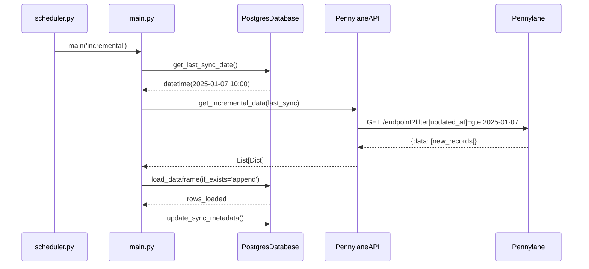

# Architecture technique

## Vue d'ensemble



## Composants

### 1. Extraction (pennylane_api.py)

**Rôle:** Communication avec API Pennylane

**Fonctionnalités:**
- Rate limiting (5 requêtes/seconde)
- Gestion pagination automatique
- Retry avec backoff exponentiel
- Extraction incrémentielle

```python
api = PennylaneAPI(api_key, base_url, rate_limit=4.5)
data = api.get_paginated_data('/customer_invoices')
```

### 2. Transformation (transformations.py)

**Rôle:** Nettoyage basique

**Transformations:**
- Normalisation noms colonnes (snake_case)
- Suppression doublons
- Nettoyage espaces

!!! info "Transformations métier"
    Les transformations avancées sont faites dans Jupyter Notebook

### 3. Chargement (database.py)

**Rôle:** Stockage PostgreSQL

**Fonctionnalités:**
- Création automatique tables
- Batch insert optimisé
- Upsert (INSERT ON CONFLICT)
- Logs exécution
- Métadonnées synchronisation

### 4. Orchestration (main.py)

**Rôle:** Coordination ETL

**Modes:**
- `full`: Extraction complète
- `incremental`: Nouvelles données uniquement

### 5. Planification (scheduler.py)

**Rôle:** Exécution automatique

**Paramètres:**
- Intervalle configurable (défaut: 10 min)
- Mode incrémentiel
- Logs détaillés

## Flux de données

### Extraction complète (full)



### Extraction incrémentielle (incremental)



## Base de données

### Schéma PostgreSQL

```sql
-- Schéma principal
CREATE SCHEMA pennylane;

-- Tables de données (créées dynamiquement)
CREATE TABLE pennylane.invoices (
    id SERIAL PRIMARY KEY,
    -- colonnes dynamiques selon API
    _loaded_at TIMESTAMP DEFAULT NOW()
);

-- Logs ETL
CREATE TABLE pennylane.etl_logs (
    id SERIAL PRIMARY KEY,
    execution_date TIMESTAMP DEFAULT NOW(),
    table_name VARCHAR(255),
    records_extracted INTEGER,
    records_loaded INTEGER,
    status VARCHAR(50),
    error_message TEXT,
    execution_time_seconds NUMERIC(10, 2)
);

-- Métadonnées synchro
CREATE TABLE pennylane.sync_metadata (
    table_name VARCHAR(255) PRIMARY KEY,
    last_sync_date TIMESTAMP,
    total_records INTEGER
);
```

### Optimisations

**Batch insert:** 1000 lignes par batch
**Index:** Sur colonnes date pour requêtes incrémentales
**Connexion pooling:** Context manager
**Transactions:** Commit par batch

## Gestion configuration

### Hiérarchie

```
1. .env (secrets)
   ↓
2. config_loader.py (validation)
   ↓
3. config.json (endpoints)
   ↓
4. Configuration complète
```

### Sécurité

- `.env` jamais committé (`.gitignore`)
- Validation à l'initialisation
- Erreurs explicites si config invalide

## Rate Limiting

### Stratégie

```python
min_interval = 1.0 / rate_limit  # 4.5 req/s → 0.22s
time_since_last = now() - last_request_time

if time_since_last < min_interval:
    sleep(min_interval - time_since_last)
```

### Gestion 429 (Rate Limit Exceeded)

```python
if response.status_code == 429:
    retry_after = int(response.headers.get('Retry-After', 60))
    sleep(retry_after)
    retry()
```

## Gestion erreurs

### Niveaux

1. **Erreur fatale** → Stop immédiat (ex: config invalide)
2. **Erreur endpoint** → Log + Continue autres endpoints
3. **Erreur réseau** → Retry avec backoff

### Logs

```python
# Logs application
logs/pennylane_etl.log

# Logs PostgreSQL
pennylane.etl_logs
```

## Performance

### Optimisations implémentées

- ✅ Batch insert (1000 rows)
- ✅ Pagination automatique
- ✅ Rate limiting intelligent
- ✅ Context manager DB
- ✅ Extraction incrémentielle

### Mesures

| Volume | Temps extraction | Temps chargement |
|--------|------------------|------------------|
| 10k lignes | ~30s | ~5s |
| 100k lignes | ~5 min | ~30s |
| 1M lignes | ~45 min | ~5 min |

## Scalabilité

### Vertical (actuel)

- Single process
- Sequential endpoints
- Fonctionne jusqu'à 1-2M lignes/endpoint

### Horizontal (futur v1.1)

- Multiprocessing par endpoint
- Queue système (Celery/RabbitMQ)
- Cache Redis

## Docker

### Services

```yaml
postgres:
  - PostgreSQL 16 Alpine
  - Optimisé analytique
  - Volumes persistants

pgadmin:
  - Interface web admin
  - Optionnel
```

### Réseau

```
Host:5432 ←→ Docker:5432 (postgres)
Host:5050 ←→ Docker:80 (pgadmin)
```

## Monitoring

### Métriques disponibles

```sql
-- Logs exécution
SELECT table_name,
       AVG(execution_time_seconds) as avg_time,
       COUNT(*) as executions,
       SUM(CASE WHEN status='failed' THEN 1 ELSE 0 END) as failures
FROM pennylane.etl_logs
GROUP BY table_name;

-- Dernières synchros
SELECT * FROM pennylane.sync_metadata;
```

### Futur (v1.3)

- Dashboard Streamlit
- Alertes email
- Métriques temps réel
