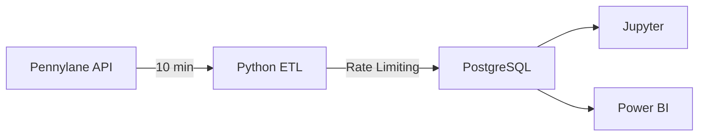

# ETL Pennylane → PostgreSQL → Power BI

  

Bienvenue sur la documentation officielle de **Penny** !

## 🎯 Présentation

Penny est une solution ETL (Extract, Transform, Load) qui résout les problèmes d'actualisation des données Pennylane pour Power BI.

### Problèmes résolus

| Avant | Après Penny |
|-------|-------------|
| ⏰ Actualisation API : 2 heures | ✅ 10 minutes |
| 🐌 Actualisation Power BI : 30-60 min | ✅ 2-5 minutes |
| 💾 Transformations dans Power Query (lent) | ✅ Python + SQL (rapide) |
| 📊 Volume limité | ✅ Millions de lignes |

## 🚀 Démarrage rapide

```bash
# 1. Cloner
git clone https://github.com/yves34690/Penny.git
cd Penny

# 2. Configurer
cp .env.example .env
nano .env  # Ajouter PENNYLANE_API_KEY

# 3. Installer
pip install -r requirements.txt
docker-compose up -d

# 4. Lancer
cd src && python main.py full
```

## 📚 Documentation

- [Guide de démarrage](guide-demarrage.md)
- [Guide utilisateur](guide-utilisateur.md)
- [Configuration](configuration.md)
- [API Reference](api-reference.md)
- [Dépannage](depannage.md)

## 🏗️ Architecture



## 💡 Fonctionnalités

✅ **Extraction automatique** - Toutes les 10 minutes
✅ **Rate limiting** - Respect limite API (5 req/sec)
✅ **Incrémentiel** - Seulement nouvelles données
✅ **PostgreSQL** - Stockage performant
✅ **Sécurisé** - Gestion .env des secrets
✅ **Documenté** - Guides complets
✅ **Open Source** - MIT License

## 🤝 Contribution

Les contributions sont les bienvenues ! Voir [CONTRIBUTING.md](https://github.com/yves34690/Penny/blob/main/CONTRIBUTING.md)

## 📝 Licence

MIT License - Voir [LICENSE](https://github.com/yves34690/Penny/blob/main/LICENSE)

---

**Créé avec ❤️ par yves34690**
